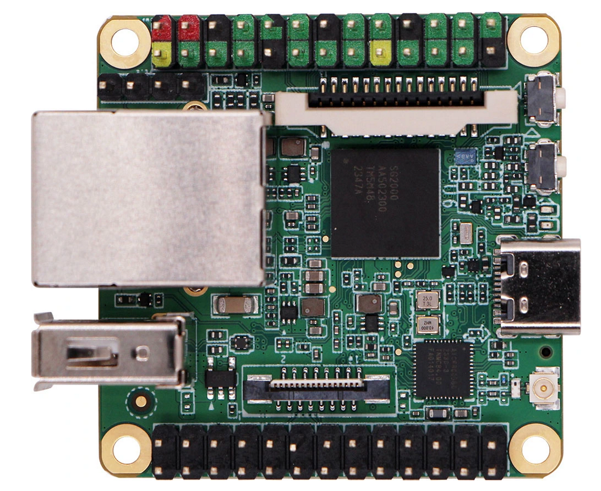

# Milkv Duo S
---
## 开发板说明
---

### 开发板简介
> Milk-V DuoS 是 Duo 的升级型号，升级了 SG2000 主控，拥有更大的内存（512MB）和更多的 IO 接口。 它集成了 WI-FI 6/BT 5 无线功能，并配备 USB 2.0 HOST 接口和 100Mbps 以太网端口，方便用户使用。 它支持双摄像头（2x MIPI CSI 2 通道）和 MIPI 视频输出（MIPI DSI 4 通道），可实现多种应用。 DuoS 还支持通过开关在 RISC-V 和 ARM 启动之间切换。 通过性能和接口的增强，DuoS 更适合各种场景和更复杂的项目开发需求。

[关于SG2000主控](https://github.com/milkv-duo/duo-files/tree/main/duo-s/datasheet)

### Demo简介
---
- demo说明
> Duo S板卡使用SG2000主控，SG2000集成了一块算力达到0.5TOPS的TPU，可以支持主流的神经网络架构。本Demo演示了在Duo S上使用SG2000的TPU以及算能的tpu-sdk运行MobileNetV2神经网络并基于此进行图像分类。

- demo源码链接
> [MobileNet 模型](https://github.com/shicai/MobileNet-Caffe.git)

- sdk链接
> [tpu-sdk-sg200x](https://github.com/milkv-duo/tpu-sdk-sg200x.git)

### Demo运行
---
详见另一[文档](https://github.com/Gekyume777/-Milk-V-Duo-S-SG2000-512M-/blob/main/MobileNetV2.md)

## Demo运行总结
---
- sdk集成说明
> 该demo运行只用到了一个sdk，即[tpu-sdk-sg200x](https://github.com/milkv-duo/tpu-sdk-sg200x.git)
- 问题描述及状态
> 原Demo有一些命令存在路径偏移，应该是MobileNet下目录在最近发生变更导致的，在Demo运行的[文档](https://github.com/Gekyume777/-Milk-V-Duo-S-SG2000-512M-/blob/main/MobileNetV2.md)中这些问题已被修复。其中由于需要在docker内配置环境，建议在教程中加上一些网络设置的帮助。（需要挂VPN并且开TUN才能成功从docker仓库拉镜像）
