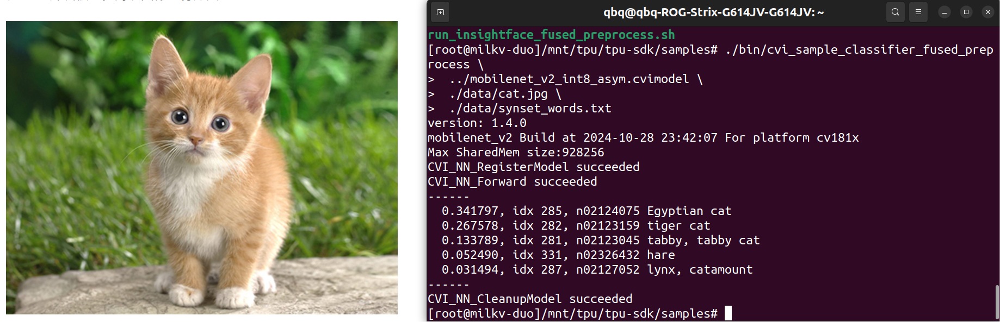

# Tpu测试-MobileNetV2神经网络图像分类
---
## docker环境配置
### 拉取镜像
安装完docker后拉取以下镜像:
```bash
docker pull sophgo/tpuc_dev:v3.1
```
可能会遇到的问题：
```markdown
这里需要挂VPN，并且由于是在docker容器内进行镜像拉取，需要设置代理（可以在VPN中直接开启TUN模式，如果开启失败，则需要给VPN内核加权限）
```
### 启动容器
完成拉取后，基于拉取的镜像，启动一个docker容器
```bash
docker run --privileged --name <container_name> -v /workspace -it sophgo/tpuc_dev:v3.1
```
其中这里的 **container_name** 改为你想要的容器命名（随便取）

接着在docker容器内检查当前目录，并切换到 **workspace**(如果原本不在这的话)
```bash
cd /workspace/
``` 
### 获取工具包并添加环境变量
在 Docker 终端中下载 TPU-MLIR 模型转换工具包
```bash
git clone https://github.com/milkv-duo/tpu-mlir.git
```
在 Docker 终端中，用 **source** 命令添加环境变量
```bash
source ./tpu-mlir/envsetup.sh
```
---
## 模型转换
该步骤全程在docker容器内终端完成
模型转换步骤如下：

 - Caffe 模型转换成 MLIR
 - 生成量化需要的校准表
 - MLIR 量化成 INT8 非对称 cvimodel

### 准备工作环境
创建并进入 mobilenet_v2 工作目录，注意是与 tpu-mlir 同级的目录
```bash
# mkdir mobilenet_v2 && cd mobilenet_v2
```
下载官网的 MobileNet 模型:
```bash
git clone https://github.com/shicai/MobileNet-Caffe.git
```
将克隆的 MobileNet-Caffe 目录下的模型文件、 tpu-mlir 工具链目录下的图片文件放入当前目录下
```bash
cp MobileNet-Caffe/mobilenet_v2_deploy.prototxt .
cp MobileNet-Caffe/mobilenet_v2.caffemodel .
cp -rf ${TPUC_ROOT}/regression/dataset/ILSVRC2012/ .
cp -rf ${TPUC_ROOT}/regression/image/ .
```
这里的 ${TPUC_ROOT} 是环境变量，对应 tpu-mlir 目录，是在前面配置 Docker 开发环境中 source ./tpu-mlir/envsetup.sh 这一步加载的
创建并进入 work 工作目录，用于存放编译生成的 MLIR、cvimodel 等文件

```bash
mkdir work && cd work
```
   
### Caffe 模型转换成 MLIR
模型输入是图片，在转模型之前我们需要了解模型的预处理。如果模型用预处理后的 npz 文件做输入，则不需要考虑预处理。预处理过程用公式表达如下($x$代表输入): $$ y = (x-mean)\times scale $$

本例中的模型是 **BGR** 输入, **mean** 和 **scale** 分别为 **103.94**,**116.78**,**123.68** 和 **0.017**,**0.017**,**0.017**，模型转换命令如下(注意在workspace/mobilenet_v2/work目录下运行该命令):
```bash
model_transform.py \
 --model_name mobilenet_v2 \
 --model_def ../mobilenet_v2_deploy.prototxt \
 --model_data ../mobilenet_v2.caffemodel \
 --input_shapes [[1,3,224,224]] \
 --resize_dims=256,256 \
 --mean 103.94,116.78,123.68 \
 --scale 0.017,0.017,0.017 \
 --pixel_format bgr \
 --test_input ../image/cat.jpg \
 --test_result mobilenet_v2_top_outputs.npz \
 --mlir mobilenet_v2.mlir
```
转成 MLIR 模型后，会生成一个 **mobilenet_v2.mlir** 文件，该文件即为 mlir 模型文件，还会生成一个 **mobilenet_v2_in_f32.npz** 文件和一个 **mobilenet_v2_top_outputs.npz** 文件，是后续转模型的输入文件,这几个文件均正常生成则转换成功。

### MLIR 转 INT8 模型
**生成量化需要的校准表**

运行 run_calibration.py 得到校准表，输入数据的数量根据情况准备 100~1000 张左右。 这里用现有的 100 张来自 ILSVRC2012 的图片举例，执行 **calibration** 命令：
```bash
 run_calibration.py mobilenet_v2.mlir \
 --dataset ../../tpu-mlir/regression/dataset/ILSVRC2012 \
 --input_num 100 \
 -o mobilenet_v2_cali_table
```
运行完成后会生成名为 **mobilenet_v2_cali_table** 的文件, 该文件用于后续编译 INT8 模型的输入文件

### MLIR 量化成 INT8 非对称 cvimodel

用 **model_deploy.py** 脚本参数使用 asymmetric 进行非对称量化，将 MLIR 文件转成 INT8 非对称量化模型:
```bash
 model_deploy.py \
 --mlir mobilenet_v2.mlir \
 --asymmetric \
 --calibration_table mobilenet_v2_cali_table \
 --fuse_preprocess \
 --customization_format BGR_PLANAR \
 --chip cv181x \
 --quantize INT8 \
 --test_input ../../MobileNet-Caffe/cat.jpg \
 --model mobilenet_v2_int8_asym.cvimodel
```
提示

*开发板是 Duo 使用参数 --chip cv180x* 
*开发板是 Duo 256M/Duo S 使用参数 --chip cv181x。*
*在此我们使用Duo S*

编译完成后, 会生成名为 **mobilenet_v2_int8_asym.cvimodel** 的文件

---
## 上板验证
先登陆到Duo S板卡终端
[从SD卡烧写镜像启动教程](https://milkv.io/zh/docs/duo/getting-started/boot)
[ssh登陆板卡终端教程](https://milkv.io/zh/docs/duo/getting-started/setup)

### 在开发板准备文件(获取 tpu-sdk)
在 Docker 终端下切换到 /workspace 目录
```bash
cd /workspace
```
下载 tpu-sdk Duo/Duo 256M/Duo S分别执行以下命令
**Duo** 
```bash
git clone https://github.com/milkv-duo/tpu-sdk-cv180x.git
mv ./tpu-sdk-cv180x ./tpu-sdk
```
**Duo 256M/Duo S**
```bash
git clone https://github.com/milkv-duo/tpu-sdk-sg200x.git
mv ./tpu-sdk-sg200x ./tpu-sdk
```
将开发工具包和模型文件拷贝到 Duo 开发板上
在 duo 开发板的终端中，新建文件目录 /mnt/tpu/
```bash
mkdir -p /mnt/tpu/tpu-sdk && cd /mnt/tpu
```
在 Docker 的终端中，将 tpu-sdk 和模型文件拷贝到 Duo 开发板上
```bash
scp -r /workspace/tpu-sdk root@192.168.42.1:/mnt/tpu/tpu-sdk
scp /workspace/mobilenet_v2/work/mobilenet_v2_int8_asym.cvimodel root@192.168.42.1:/mnt/tpu/tpu-sdk/
```
设置环境变量
```bash
cd /mnt/tpu/tpu-sdk
source ./envs_tpu_sdk.sh
```

### 进行图像分类测试
进入 samples 目录
```bash
cd samples
```
查看 cvimodel info
```bash
./bin/cvi_sample_model_info ../mobilenet_v2_int8_asym.cvimodel
```
运行图像分类测试
```bash
./bin/cvi_sample_classifier_fused_preprocess \
 ../mobilenet_v2_int8_asym.cvimodel \
 ./data/cat.jpg \
 ./data/synset_words.txt
```

得到以下输出证明测试成功



